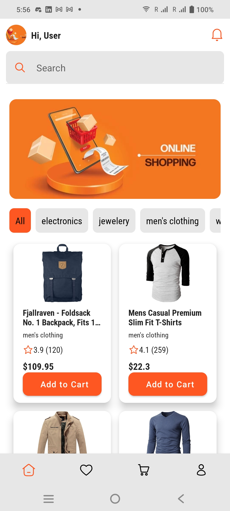
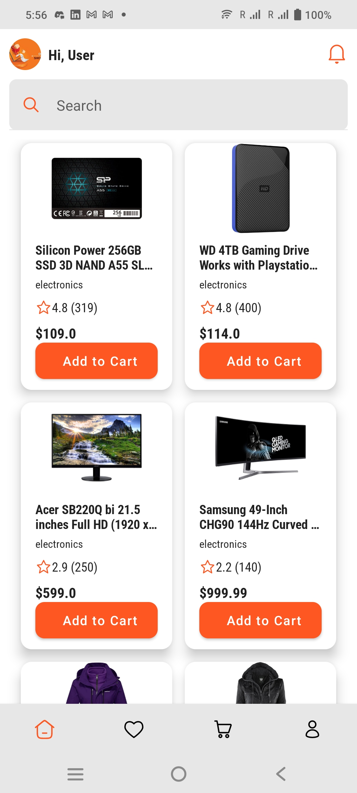
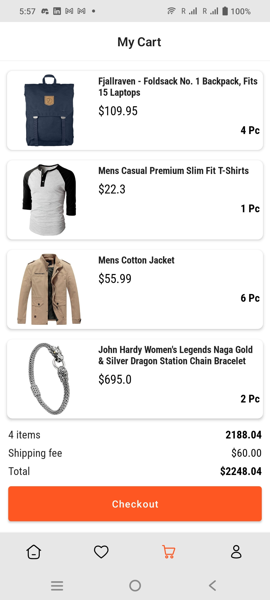
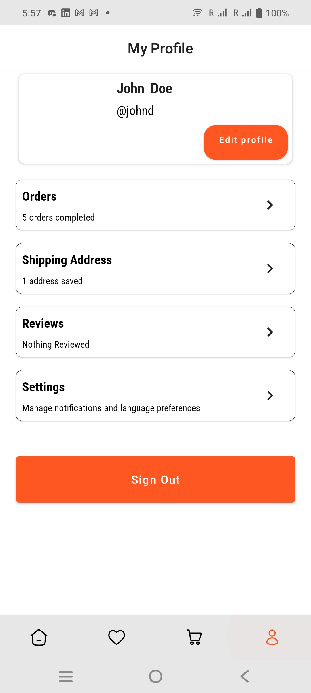
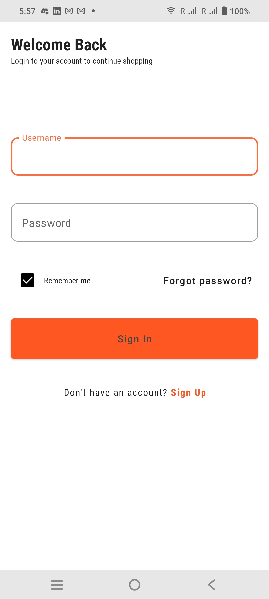
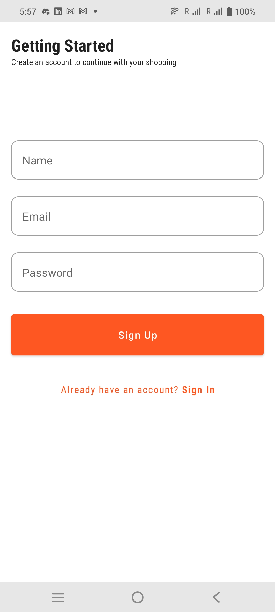

# E-Commerce App

This is an E-Commerce app built using Kotlin and Jetpack Compose, integrated with an API for dynamic content management. The app features product browsing, shopping cart management, user profiles, and more. It's designed to provide a smooth and responsive shopping experience.

## Screenshots








# E-Commerce App

An Android E-Commerce app built using Kotlin and Jetpack Compose. It is modularized, following clean architecture principles for better maintainability and scalability.

## Architecture

The app follows **Clean Architecture** with a **modular** approach:

- **Core Layer**: Contains shared resources like models, utilities, and dependency injection setup.
- **Feature Modules**: Each feature (authentication, cart, profile, etc.) is self-contained with its own `data`, `domain`, and `presentation` layers.
  - **Data**: Handles data management (e.g., API calls, databases).
  - **Domain**: Contains business logic and use cases.
  - **Presentation**: UI logic using Jetpack Compose for a declarative UI.
- **Dependency Injection**: Managed by Dagger Hilt to handle dependencies across modules.
- **Jetpack Compose**: Used for modern, declarative UI development.

## Key Features

- Product browsing and search.
- Shopping cart management.
- User authentication (login/signup).
- User profile management.

## Technology Stack

- **Kotlin**: Programming language.
- **Jetpack Compose**: UI framework.
- **Dagger Hilt**: Dependency Injection.
- **Retrofit**: API integration.

- ## Getting Started

Clone the repository:
   ```bash
   git clone https://github.com/yourusername/e-commerce-app.git
